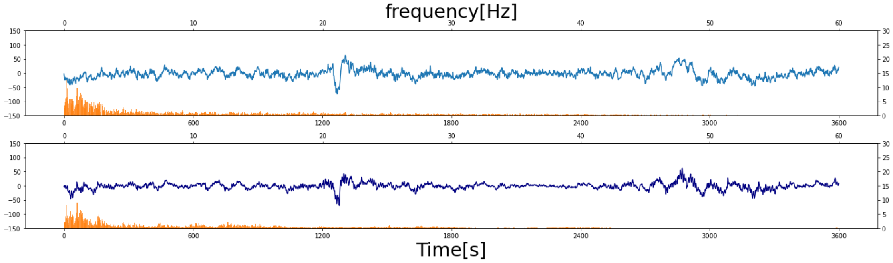

# Thesis program

The clinical test to determine sleep stages of a subject based on biological signals is called sleep stage scoring.
Although some models have been proposed to automatically determine sleep stages, but sometimes the accuracy of these models is decreased due to noise and differences in the signals caused by individual differences.
In this study, we developed a signal processing technique based on style transfer, aiming to reduce the biological signal components that lead to decrease the accuracy.
In the experiment, we confirmed that the proposed method improved the accuracy of the existing stage scoring model by inputting the converted signal.
We also investigated the relationship between the degree of style transfer and the improvement of scoring accuracy.



## Setup

### Requirements

```
conda install pyedflib
conda install scipy
conda install numpy
conda install matplotlib
conda install seaborn
conda install pandas
conda install tensorflow as tf
conda install keras
```

### Extract data

```
tar -zxvf data_sec.tar.gz
```

## Usage

```
python main.py --rmse --rec 2 --compare 25
```